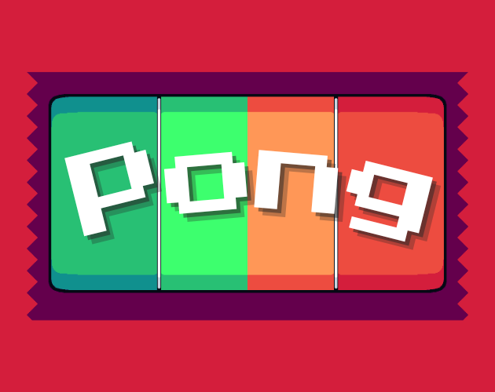
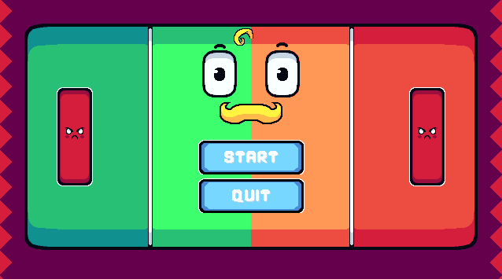
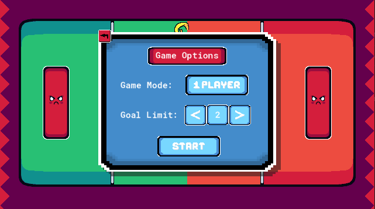
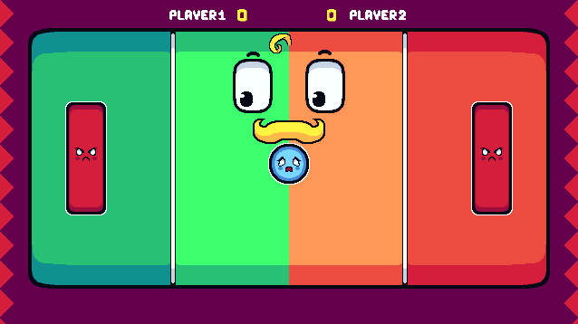
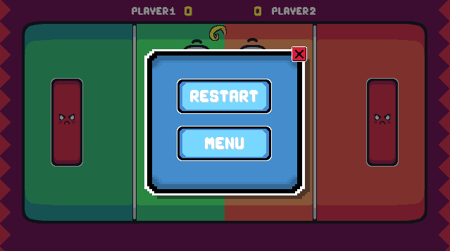
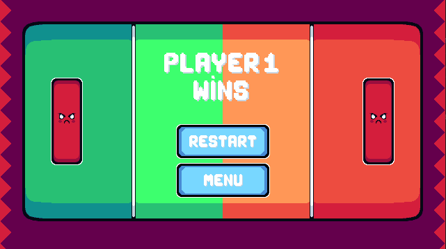

  # 🏓 Pong Game
  
  

 

Meu primeiro projeto no GameMaker, recriando o Pong com o curso NoNeClass. 

 

- Jogo para 1 ou 2 jogadores
- Placar funcional
- Física básica da bolinha e colisões
- Sons e efeitos simples

 

- GameMaker Studio 2
- Linguagem GML

 

👉 https://hiyara.itch.io/pong
